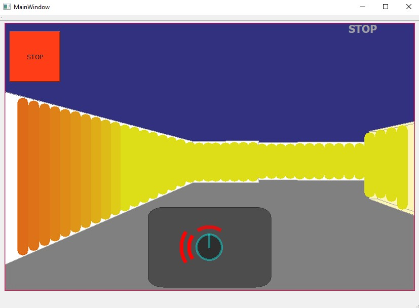
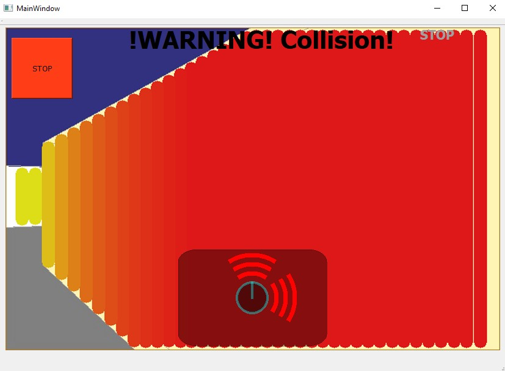
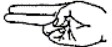
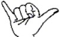

# ESA_IROBOT_HMI

## Opis úlohy:

Zadaním bolo navrhnúť používateľské prostredie pre priame riadenia mobilného robota typu Kobuki s diferenciálnym podvozkom. Používateľ má byť schopný ovládať pohyb robota pomocou zadefinovaných statických giest a zároveň vidieť v reálnom čase informácie z kamery.

## Používateľská dokumentácia:

Pre správne fungovanie programu je potrebné vopred spustiť:

- Kobuki simulátor
- Skeleton tracker
- Následne spustiť samotný program

Používateľské rozhranie sa skladá z kamery, identifikátorov pre informáciu o vzdialenosti robota ku prekážkam a STOP tlačidla v ľavom hornom rohu pre núdzové zastavenie robota. Ukážka tohto rozhrania je na nasledujúcom obrázku:

Pohľad v kamere je obohatený o spracované dáta z lidaru pre uľahčenie práce operátorovi. Ide hlavne o zvýraznenie prekážky červenou farbou a so vzdialenosťou sú tieto farby menej sýtejšie.

Pri vzdialenosti menej ako 30cm od prekážky, dostane operátor aj informáciu ,,!WARNING! Collision", že sa blíži ku kolízií s touto prekážkou tak ako je to naznačené na nasledujúcom obrázku:

Samotné ovládanie pohybu robota je realizované pomocou statických giest, ktoré sú zadefinované takýmto spôsobom:

### Gesto vpred:

### Gesto vzad:

### Gesto STOP (pravou rukou):

### Gesto vľavo (a rovnaké gesto vykonané pravou rukou) vpravo:

